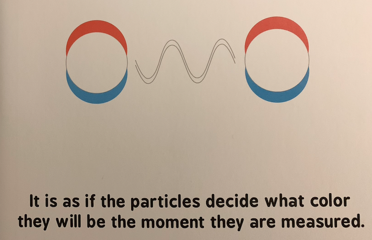

_Quantum entanglement_ is an intimidating phrase to encounter when you barely know what _quantum_ means (and maybe it is even if you do). My daughter's book, [_Quantum Entanglement for Babies_](https://www.amazon.com/Quantum-Entanglement-Babies-Baby-University/dp/1492656232), also does a good job of keeping the mystery alive:

Now I've just barely scratched the surface in quantum computing (and I mean _barely_, like I've gotten so far as to understand how to build a circuit to add two bits together. Yes, 1 + 1 = 2). But as I was going through the section on quantum entanglement in [this tutorial](https://github.com/Qiskit/textbook/tree/main/notebooks/intro), I immediately noticed something familiar that it was getting at (albeit in an unfamiliar, roundabout way). And that was _statistical independence_.

# Some background

We can represent the state of [_qubits_](https://en.wikipedia.org/wiki/Qubit) (like a [_bit_](https://en.wikipedia.org/wiki/Bit), but in quantum), at a given point in time, as _state vectors_, which (loosely) correspond to the probability they will be measured in a particular state.

For example, suppose we have a qubit, $q_0$, that has the following state vector:

$$q_0 = |0\rangle = \left[\begin{array}{c} 1 \\ 0 \\ \end{array}\right]$$

The _positions_ of the vector represent the possible states the qubit can be in. Namely, since it's basically just a [bit](https://en.wikipedia.org/wiki/Bit), 0 (position 1) or 1 (position 2). The _entries_ in the vector represent (again, loosely) the probability that the qubit will take on that state when measured. So in this example,

$$P(q_0 = 0) = 1 \hskip.1in P(q_0=1)=0$$
It will _always_ be measured in the 0 state.

Now suppose we introduce another qubit, $q_1$. And remember, computers just store information as sequences of bits. This qubit can also only be measured in states 0 or 1. Thus, the possible  [bit strings](https://en.wikipedia.org/wiki/Binary_code) are:

$q_1q_0$ | Represents the number...
-------- | ------------------------
  00     | $(0\times2^1) + (0 \times 2^0) = 0$
  01     | $(0\times2^1) + (1 \times 2^0) = 1$
  10     | $(1\times2^1) + (0 \times 2^0) = 2$
  11     | $(1\times2^1) + (1 \times 2^0) = 3$

So one possible two-qubit state vector is:

$$|01\rangle = \left[\begin{array}{c} 0 \\ 1 \\ 0 \\ 0 \\ \end{array}\right]$$

where, again, the _positions_ represent the possible sequences of qubits (00, 01, 10, 11; there will always be $2^n$ possible states, where $n$ is the number of qubits), and the entries (for the third time, loosely) represent the probability of measuring that sequence. In this case, 

$$P(q_0 = 1 \cap q_1 = 0) = 1; \hskip.1in P(\text{other combos}) = 0$$
So now we can imagine the more interesting case where more than one entry is non-zero, that is, multiple different states have a positive probability of being measured. Given it still has to lead to a valid probability distribution, this means that the 100% must be distributed amongst the possibilities.

The final thing I'll leave here is that the entries actually represent the _square root_ of the probability, which is why I've been emphasizing probability "loosely". So the "valid probability distribution" constraint applies to the _square_ of the vector entries. In the first example above, a more complete way to write this would be:

$$P(q_0 = 0) = 1^2 = 1 \hskip.1in P(q_0=1) = 0^2 = 0$$

# What is entanglement?

The [tutorial](https://github.com/Qiskit/textbook/blob/main/notebooks/intro/entangled-states.ipynb) has us consider a couple of two-qubit state vectors:

$$|\Phi^+\rangle = \frac{1}{\sqrt{2}} \left[\begin{array}{c} 1 \\ 0 \\ 0 \\ 1 \\ \end{array}\right] \hskip.2in |+0\rangle = \frac{1}{\sqrt{2}} \left[\begin{array}{c} 1 \\ 0 \\ 1 \\ 0 \\ \end{array}\right]$$

If we let $X = q_1q_0$, that is, the bit string measured from the qubits, these imply the following:

$$P_{|\Phi^+\rangle}(X = 00) = P_{|\Phi^+\rangle}(X = 11) = \frac{1}{2}$$

$$P_{|+0\rangle}(X = 00) = P_{|+0\rangle}(X = 10) = \frac{1}{2}$$

Notice how both bits change in $|\Phi^+\rangle$, but only one changes in $|+0\rangle$. The former is _entangled_, the latter is not. This is because we cannot separate $|\Phi^+\rangle$ into [superpositions](https://en.wikipedia.org/wiki/Quantum_superposition) of two individual, one-qubit state vectors. But in $|+0\rangle$, we can:

$$q_0 = \left[\begin{array}{c} 1 \\ 0 \\ \end{array}\right] = |0\rangle$$
$$q_1 = \frac{1}{\sqrt{2}} \left[\begin{array}{c} 1 \\ 1 \\ \end{array}\right] = |+\rangle$$

Implying that $q_0$ will always be measured to 0, and all uncertainty (random variability) lies in measuring $q_1$. This is known as a _product_ state, because the probabilities in the two-qubit state vector can be determined by a cross-product of the individual ones.

# It's just independence

[Statistical independence](https://en.wikipedia.org/wiki/Independence_(probability_theory)) occurs when the probability of observing an event does not change once we know something about another one. In our case, we can pretty clearly see this holds for $|+0\rangle$ but not $|\Phi^+\rangle$. Let's look at the latter case.

From the the two-qubit state vector, we know the possible measurements are 00 or 11. Thus, 

$$P_{|\Phi^+\rangle}(q_0 = 0) = P_{|\Phi^+\rangle}(q_0 = 1) = \frac{1}{2}$$
$$P_{|\Phi^+\rangle}(q_1 = 0) = P_{|\Phi^+\rangle}(q_1 = 1) = \frac{1}{2}$$

Marginally, each qubit has an equal chance of being measured 0 or 1. But once we know something about the state of the other qubit, this changes:

$$P_{|\Phi^+\rangle}(q_1 = 0|q_0 = 0) = 1$$
$$P_{|\Phi^+\rangle}(q_1 = 0|q_0 = 1) = 0$$
$$P_{|\Phi^+\rangle}(q_1 = 1|q_0 = 0) = 0$$
$$P_{|\Phi^+\rangle}(q_1 = 1|q_0 = 1) = 1$$

We could flip those around and condition $q_0$ on $q_1$ and we'd end up with the same result. What this shows is that in the entangled state,

$$P(q_0|q_1) \neq P(q_0)$$
implying

$$P(q_0 \cap q_1) \neq P(q_0)P(q_1)$$

and therefore are not independent. Once we know (measure) one qubit, we automatically know what the other one will be. If you go through the same math for $|+0\rangle$, you'll see the marginal and conditional probabilities are in fact equal, and thus independent.

Now I don't know if/how this might change once you start introducing more qubits or allow for the full range of [phase](https://github.com/Qiskit/textbook/blob/main/notebooks/intro/what-is-quantum.ipynb), but to keep things intuitive, my working definition of quantum entanglement is:

**_Does the probability of a qubit being measured to a particular state depend on the state of another qubit? If yes, they are entangled; otherwise, they are not._**