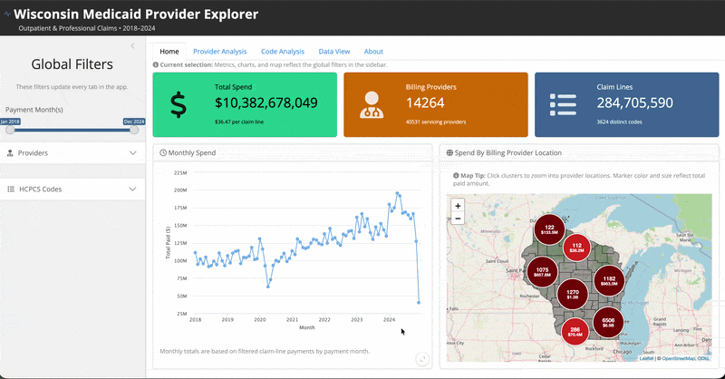
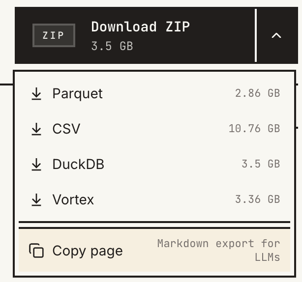



In February 2026, the [US Department of Health & Human Services](https://www.hhs.gov/) (HHS) released a [data file](https://opendata.hhs.gov/datasets/medicaid-provider-spending/) containing [Medicaid](https://www.medicaid.gov/) monthly spending for outpatient and professional claims by provider and [HCPCS code](https://www.cms.gov/medicare/coding-billing/healthcare-common-procedure-system) from 2018-2024 across the entire United States. It's a pretty massive dataset (~238M rows), so being able to set it up to efficiently explore it on your own machine takes a little bit of care. This article is meant to show you how to set up a basic data model from a few different important sources to be able to conduct useful analysis using some cool frameworks I was first exposed to along the way. Specifically, this guide is more so scoped around the assumption that you want to conduct analysis for a specific state (in my case, Wisconsin) as to reduce the data size you have to work with. But you could apply this to any state of your choosing, or try to build the data model for the entire country. 

> _Note that all code will be written in the R environment._

# First, an app

To start things off, I'll showcase what I've been building with this dataset:



It is an [R Shiny](https://shiny.posit.co/) application exploring Medicaid spending for the state of Wisconsin that is hosted on [Posit Connect Cloud](https://connect.posit.cloud/). You can access the live app [here](https://019e1de6-462e-6815-a89d-19a59d5bf929.share.connect.posit.cloud/) and the source code [here](https://github.com/zajichek/medicaid_claims_explorer).

I won't go into a ton of detail about the specifics of everything in there, but feel free to go and try it out. It's certainly very fun and interesting data to explore. There are filters to search by individual providers and codes, conduct provider-level or code-level analysis, and download your selected dataset. My suggestion would be to first read through the _About_ tab so you can understand more context about what is (and isn't included) and how to use it.

```{r}
```

Now to the data model `r emo::ji("backhand index pointing down")`

# Accessing the dataset

The first step is to of course go and download the [Medcaid spending data file](https://opendata.hhs.gov/datasets/medicaid-provider-spending/) from the [HHS Open Data Platform](https://opendata.hhs.gov/). When you go to the webpage, click the drop-down arrow in the upper-right to see the download options:



As I learned along the way, I would _not_ advise using the `.csv` file (just look at those size differences!). Instead, I opted to use the `.duckdb` file as my primary source, though I've never used [DuckDB](https://duckdb.org/) before. I also downloaded the [`.parquet`](https://parquet.apache.org/) file for comparison, but never used those file types either. Turns out these are both _extremely_ useful frameworks to learn to process and work with (particularly large) data. In fact, they go really well _together_ as well.

## Setup your environment

Before we go any further, make sure you have the required packages installed to begin working with this data in R:

```{r, eval = FALSE}
# Install the packages
install.packages("DBI")
install.packages("duckdb")
```

Now let's take your downloaded `.duckdb` file and put it in an assumed directory structure, like:

```
- data/
  + medicaid-provider-spending.duckdb
```

We'll assume that `data` is some folder on your machine that contains the dataset (which we'll add more stuff to later). I'm also assuming this is the name of the downloaded file, but rename it if necessary. Now let's just create an R variable that points to this directory. For example, 

```{r, echo = FALSE}
root <- "/Users/alexzajichek/Documents/GitHub/Repositories/medicaid_claims_explorer/data/raw"
```

```r
root <- "/path/to/my/data"
```

Now if you run `list.files()` you should see your file within `root` (note that I used `stringr::str_subset()` here because I already have other files in my directory, but you don't need that part):

```{r}
list.files(root) |> 

  # Filtering to ignore other files
  stringr::str_subset("medicaid-provider-spending[.]duckdb")
```

## A first glance

Now let's just take a peek under the hood and get the mechanics working with the [`duckdb` package](https://duckdb.org/docs/current/clients/r). In short, [DuckDB](https://duckdb.org/) is a SQL database that runs very efficiently wherever you are executing your code (e.g., so instead of needing a full database setup, you can literally just have a database sitting in a file and write queries against it, among many other possibilities). We'll start by just loading the packages and looking at what's inside our `.duckdb` file.

```{r, warning = FALSE, message = FALSE}
# Load packages
library(DBI)
library(duckdb)
library(tidyverse)

# Connect to the database
con <- dbConnect(duckdb::duckdb(), paste0(root, "/medicaid-provider-spending.duckdb"))

# List tables
dbListTables(con)
```

The `dbListTables()` function list the tables in our database. There's only one (1) and it's called `dataset`. Now we can assess the columns in the table:

```{r}
# Get schema info
dbGetQuery(con, "DESCRIBE dataset")
```

Just as the [website](https://opendata.hhs.gov/datasets/medicaid-provider-spending/) describes, we have rows that show numeric summaries such as monthly total paid amount, claims lines, and unique patients by HCPCS code for combinations of who the billing and servicing providers were. Let's look at some of the actual data:

```{r}
# Select 10 rows of data to view
dbGetQuery(con, "SELECT * FROM dataset LIMIT 10") |> as_tibble()
```

Finally, let's take a look some overall dataset summaries such as the number of records and the total dollar amount represented in the dataset:

```{r}
# Row count + paid amount total
dbGetQuery(
  con,
  "SELECT COUNT(1) AS RowCount, SUM(TOTAL_PAID) AS TotalPaid FROM dataset"
) |>

  # Format the result
  mutate(
    RowCount = scales::comma(RowCount),
    TotalPaid = scales::dollar(TotalPaid)
  ) |>

  # Make a clean table
  knitr::kable(format = "html") |>
  kableExtra::kable_styling()
```

## An initial filter {#filtered-data}

One thing you'll notice is that the dollar amount totals are _enormous_ (~$21T). Upon further research, this total is way more than would be expected over this time period for outpatient and professional claims. And indeed in the _Examples_ tab of the [source website](https://opendata.hhs.gov/datasets/medicaid-provider-spending/), their analysis only pertains to rows where the billing _and_ provider [NPI number](https://npiregistry.cms.hhs.gov/search) are present. This gives us a hunch that we probably need to filter some stuff out.

### Deeper evaluation

Let's explore these counts/totals by whether or not both providers are listed or not.

```{r}
dbGetQuery(
  con,
  "SELECT 
      CASE WHEN 
        BILLING_PROVIDER_NPI_NUM IS NULL OR SERVICING_PROVIDER_NPI_NUM IS NULL THEN 'One missing'
        ELSE 'Both Present'
      END AS RowStatus,
      COUNT(1) AS RowCount, 
      SUM(TOTAL_PAID) AS TotalPaid 
    FROM dataset
    GROUP BY 
    CASE WHEN 
        BILLING_PROVIDER_NPI_NUM IS NULL OR SERVICING_PROVIDER_NPI_NUM IS NULL THEN 'One missing'
        ELSE 'Both Present'
      END"
) |>

  # Format the result
  mutate(
    RowCount = scales::comma(RowCount),
    TotalPaid = scales::dollar(TotalPaid)
  ) |>

  # Make a clean table
  knitr::kable(format = "html") |>
  kableExtra::kable_styling()
```

We can see that virtually all (~95%) of the total dollar amount is captured by rows where at least one (1) provider is missing, yet these rows account for a small subset of the total number of rows. So there must be other things, like [capitation costs](https://www.dhs.wisconsin.gov/familycare/mcos/capitationrates.htm), included in these rows that are not of interest, and causes dollar amounts for distinct events we're interested in to be inflated.

On the contrary, the rows where both providers are present (which is most rows) have a total of ~$1T in spending, which is a more reasonable estimate for claims paid to providers over this time period given the context.

Given this discovery, and the fact that [the examples](https://opendata.hhs.gov/datasets/medicaid-provider-spending/) also only use these rows, we are only going to work with a filtered subset of this data.

```{r}
dbGetQuery(
  con,
  "SELECT 
    COUNT(1) AS RowCount, 
    SUM(TOTAL_PAID) AS TotalPaid 
    FROM dataset 
    WHERE 
      BILLING_PROVIDER_NPI_NUM IS NOT NULL AND 
      SERVICING_PROVIDER_NPI_NUM IS NOT NULL"
) 
```

> _This row subset will be our claims basis for the data model setup_.

Let's go ahead and close our current connection to the database (for now), and we'll come back to it later.

```{r}
# Close the connection
dbDisconnect(con, shutdown = TRUE)
```

# Building the local database

Given our exploratory work up to this point, we have somewhat of a strategy to make our own local database. However, as we'll see, to make it _state-specific_ (e.g., Wisconsin only) there will be other data sources we'll need to bring in along the way to make it happen.

## Initializing the database

We are going to start off by simply initializing a new [DuckDB](https://duckdb.org/) database in our `data` directory. This will be an empty database but makes it available for us to write to.

```{r}
# Initialize a new database (creates it if it doesn't exist)
my_db <- dbConnect(duckdb::duckdb(), paste0(root, "/wisconsin_medicaid_database.duckdb"))

# Check for tables
dbListTables(my_db)
```

## Defining the geography through providers {#geography-selection}

The first thing we're going to add to our database is _not_ the claims data, because that doesn't have geographic indicators associated with it. What we need to do is find a lookup table for the [NPI numbers](https://npiregistry.cms.hhs.gov/search) so that we can define our tables for providers from the state of Wisconsin only.

> **Goal**: Build a lookup table containing providers who primarily practice in the state of Wisconsin.

### Identifying the providers data

We can use the [NPPES NPI Files](https://download.cms.gov/nppes/NPI_Files.html) that are made available by [CMS](https://www.cms.gov/). Once you go to that page, look for the _Monthly NPPES Downloadable File Version 2 (V.2)_ and download the `.zip` file. Once that is downloaded, there are numerous files in there such as `.pdf` (giving file/field descriptions), and `_fileheader.csv` files that provide you with what the top row of column names look like (so you can open it without trying to open the full dataset). **The file we are interested in is _npidata_pfile_20050523-20260412.csv_**. _Note: Your file name may be different depending on the date you downloaded it._

::: {.callout-warning}

This dataset is massive (~11.3GB). I would recommend _not_ trying to open it directly on your computer.

:::

Place the file in your `data` directory. Your folder should look something like this now:

```
- data/
  + medicaid-provider-spending.duckdb
  + wisconsin_medicaid_database.duckdb
  + npidata_pfile_20050523-20260412.csv
```

### Developing a clean table

This is very wide data (check the companion `_fileheader.csv` file to see all the columns). Now we need figure out which ones we should select to make a smaller, more manageable table for our use. But first, how are we actually going to access this dataset? 

#### DuckDB magic

Instead of importing the entire 11GB file into memory (e.g., through `readr::read_csv()`), we can use `duckdb` to access the `.csv` file via SQL. For example, let's look at the first 10 rows of the data:

```{r}
dbGetQuery(
  my_db,
  paste0('
    SELECT *
    FROM read_csv_auto("', root, '/npidata_pfile_20050523-20260412.csv")
    LIMIT 10'
  )
) |> as_tibble()
```

We use the `read_csv_auto` function native to DuckDB to run queries on our data file directly (without pulling the whole thing into memory). We can see there are 330 columns, but we only want a small subset of those for our purposes.

#### Selecting relevant columns

After researching and reviewing the documentation, I found that the following columns capture enough relevant information.

```{r}
dbGetQuery(
  my_db,
  paste0('
    SELECT
      CAST("NPI" AS VARCHAR) AS NPI,
      "Entity Type Code" AS EntityType,
      "Provider Organization Name (Legal Business Name)" AS Organization,
      "Provider Last Name (Legal Name)" AS LastName,
      "Provider First Name" AS FirstName,
      "Provider Sex Code" AS Sex,
      "Provider Credential Text" AS Credentials,
      "Provider First Line Business Practice Location Address" AS Address,
      "Provider Business Practice Location Address City Name" AS City,
      "Provider Business Practice Location Address State Name" AS State,
      "Provider Business Practice Location Address Postal Code" AS Zip,
      "Healthcare Provider Taxonomy Code_1" AS TaxonomyCode,
      "Is Organization Subpart" AS OrganizationSubpart,
      "Last Update Date" AS LastUpdateDate,
      "NPI Deactivation Date" AS DeactivationDate,
      "NPI Reactivation Date" AS ReactivationDate
    FROM read_csv_auto("', root, '/npidata_pfile_20050523-20260412.csv")
    LIMIT 10'
  )
) |> as_tibble()
```

Notice that I also renamed the columns to make them easier to work with (e.g., by removing whitespace).

### Applying the state filter

The last, but most important, thing we need to do is to apply a relevant filter to only keep providers relevant to our scope (i.e., the state of Wisconsin). I determined that doing this based on the provider's business practice location makes the most sense. So our final query looks like this:

```{r}
dbGetQuery(
  my_db,
  paste0('
    SELECT
      CAST("NPI" AS VARCHAR) AS NPI,
      "Entity Type Code" AS EntityType,
      "Provider Organization Name (Legal Business Name)" AS Organization,
      "Provider Last Name (Legal Name)" AS LastName,
      "Provider First Name" AS FirstName,
      "Provider Sex Code" AS Sex,
      "Provider Credential Text" AS Credentials,
      "Provider First Line Business Practice Location Address" AS Address,
      "Provider Business Practice Location Address City Name" AS City,
      "Provider Business Practice Location Address State Name" AS State,
      "Provider Business Practice Location Address Postal Code" AS Zip,
      "Healthcare Provider Taxonomy Code_1" AS TaxonomyCode,
      "Is Organization Subpart" AS OrganizationSubpart,
      "Last Update Date" AS LastUpdateDate,
      "NPI Deactivation Date" AS DeactivationDate,
      "NPI Reactivation Date" AS ReactivationDate
    FROM read_csv_auto("', root, '/npidata_pfile_20050523-20260412.csv")
    WHERE "Provider Business Practice Location Address State Name" = \'WI\'
    LIMIT 10'
  )
) |> as_tibble()
```

_Note: Since we're tying recent NPI files to historical claims, we may not get exact coverage as provider lists can change, but it gives us most of what we need for meaningful analysis._

### Loading the providers to our database

Now we just need to slightly adjust our code to load the full result into the database instead of simply querying a result (i.e., use `dbExecute()`, add a `CREATE TABLE` statement, and remove the `LIMIT 10`):

```{r}
if(!dbExistsTable(my_db, "npi_wi")) {
  dbExecute(
    my_db,
    paste0('
      CREATE TABLE npi_wi AS
      SELECT
        CAST("NPI" AS VARCHAR) AS NPI,
        "Entity Type Code" AS EntityType,
        "Provider Organization Name (Legal Business Name)" AS Organization,
        "Provider Last Name (Legal Name)" AS LastName,
        "Provider First Name" AS FirstName,
        "Provider Sex Code" AS Sex,
        "Provider Credential Text" AS Credentials,
        "Provider First Line Business Practice Location Address" AS Address,
        "Provider Business Practice Location Address City Name" AS City,
        "Provider Business Practice Location Address State Name" AS State,
        "Provider Business Practice Location Address Postal Code" AS Zip,
        "Healthcare Provider Taxonomy Code_1" AS TaxonomyCode,
        "Is Organization Subpart" AS OrganizationSubpart,
        "Last Update Date" AS LastUpdateDate,
        "NPI Deactivation Date" AS DeactivationDate,
        "NPI Reactivation Date" AS ReactivationDate
      FROM read_csv_auto("', root, '/npidata_pfile_20050523-20260412.csv")
      WHERE "Provider Business Practice Location Address State Name" = \'WI\'
      '
    )
  )
}
```

_Note: We wrapped the table creation in `dbExistsTable()` so that it doesn't have to re-write my table everytime my blog post is rendered._

Now if we look at the tables in our new database, we should see the providers table loaded.

```{r}
dbListTables(my_db)
```

And we can start running queries against it:

```{r}
# View the top 10 rows
dbGetQuery(
  my_db,
  "SELECT *
    FROM npi_wi 
    LIMIT 10"
) |> as_tibble()
```

```{r}
# Count the number of providers
dbGetQuery(
  my_db,
  "SELECT
      COUNT(1) AS RowCount,
      COUNT(DISTINCT NPI) AS UniqueProviders
    FROM npi_wi 
    LIMIT 10"
) |> as_tibble()
```

### Type 1 vs. Type 2 providers

You'll notice in the `npi_wi` table that there is an `EntityType` column that takes on values `1` or `2`. Additionally, for `EntityType=1`, the first/last name of an _individual_ provider is populated. For `EntityType=2`, an organization name is populated. This field distinguishes between _Type 1_ and _Type 2_ providers (see details [here](https://www.cms.gov/files/document/npi-fact-sheet.pdf)). This is an important distinction to account for when analyzing this data. Often we'll find that _individuals_ (i.e., Type 1) will be listed as the _servicing_ provider, and an _organization_ (i.e., Type 2) will be listed as the _billing_ provider, which generally means that the individual who provided the service works for a broader organization who actually did the billing (like a hospital). 

> Throughout the dataset you'll find variations of claims where an individual or organization is listed as both the servicing and billing providers, or one of each. Keep this in mind when searching the database.

## Loading the claims data

Now that we've [restricted our provider list](#geography-selection), we can now focus on loading the actual claims data into our database. 

> **Goal**: Create a claims database table filtered to only those in our derived Wisconsin NPI provider list

### Cross-database attachment

One extremely cool feature of DuckDB is the native ability to easily allow different `.duckdb` databases to talk to one another within an exectured query. This is especially useful for us because our `npi_wi` table containing Wisconsin providers lives in our new database that we created, while the main Medicaid claims data lives in the `.duckdb` file we downloaded from HHS. Yet, we want to filter the latter to providers in the former. Luckiily, there's an easy way to do this by just attaching an external table to our working database using `ATTACH`:

```{r}
dbExecute(
  my_db, # <-- OUR database (not the one containing claims)
  paste0("ATTACH '", root, "/medicaid-provider-spending.duckdb' AS medicaid_src")
)
```

Now we can query this table from _our_ database connection (`my_db`) by specifying the full database + schema name:

```{r}
dbGetQuery(
  my_db,
  "
    SELECT *
    FROM medicaid_src.main.dataset
    LIMIT 10
  "
) |> as_tibble()
```

This means we _don't_ have to first transfer the entire giant table over to our database and then manipulate it. We can do it all in one step. 

### Developing the query

So now knowing that we can write everything in a single query, we just have to develop the logic to extract the rows of claims data we want relevant for our data model. In this case, we want to keep rows where the billing provider _or_ the servicing provider are in the set of Wisconsin providers we derived [above](#geography-selection). 

```{r}
dbGetQuery(
  my_db,
  "
  SELECT
    d.BILLING_PROVIDER_NPI_NUM AS BillingProvider,
    d.SERVICING_PROVIDER_NPI_NUM AS ServicingProvider,
    d.HCPCS_CODE AS HCPCSCode,
    d.CLAIM_FROM_MONTH AS ClaimMonth,
    d.TOTAL_PATIENTS AS Patients,
    d.TOTAL_CLAIM_LINES AS ClaimLines,
    d.TOTAL_PAID AS PaidAmount
  FROM medicaid_src.main.dataset d
  INNER JOIN npi_wi n
    ON d.BILLING_PROVIDER_NPI_NUM = n.NPI
  WHERE 
    d.BILLING_PROVIDER_NPI_NUM IS NOT NULL AND 
    d.SERVICING_PROVIDER_NPI_NUM IS NOT NULL
 
  UNION 

  SELECT
    d.BILLING_PROVIDER_NPI_NUM AS BillingProvider,
    d.SERVICING_PROVIDER_NPI_NUM AS ServicingProvider,
    d.HCPCS_CODE AS HCPCSCode,
    d.CLAIM_FROM_MONTH AS ClaimMonth,
    d.TOTAL_PATIENTS AS Patients,
    d.TOTAL_CLAIM_LINES AS ClaimLines,
    d.TOTAL_PAID AS PaidAmount
  FROM medicaid_src.main.dataset d
  INNER JOIN npi_wi n
    ON d.SERVICING_PROVIDER_NPI_NUM = n.NPI
  WHERE 
    d.BILLING_PROVIDER_NPI_NUM IS NOT NULL AND 
    d.SERVICING_PROVIDER_NPI_NUM IS NOT NULL
  
  LIMIT 10
"
) |> as_tibble()
```

The `UNION` will remove any duplicate rows that may have been returned during this execution, so the query logic works.

### Load the dataset into the database

Our last step is to then use a `CREATE TABLE` statement to formally load the restricted claims dataset into our database. Again, we'll use `dbExistsTable()` so that it only has to write it once if this code gets executed again.

```{r}
if(!dbExistsTable(my_db, "claims")) {
  dbExecute(
    my_db,
    "
    CREATE TABLE claims AS
    SELECT
      d.BILLING_PROVIDER_NPI_NUM AS BillingProvider,
      d.SERVICING_PROVIDER_NPI_NUM AS ServicingProvider,
      d.HCPCS_CODE AS HCPCSCode,
      d.CLAIM_FROM_MONTH AS ClaimMonth,
      d.TOTAL_PATIENTS AS Patients,
      d.TOTAL_CLAIM_LINES AS ClaimLines,
      d.TOTAL_PAID AS PaidAmount
    FROM medicaid_src.main.dataset d
    INNER JOIN npi_wi n
      ON d.BILLING_PROVIDER_NPI_NUM = n.NPI
    WHERE 
      d.BILLING_PROVIDER_NPI_NUM IS NOT NULL AND 
      d.SERVICING_PROVIDER_NPI_NUM IS NOT NULL
  
    UNION 

    SELECT
      d.BILLING_PROVIDER_NPI_NUM AS BillingProvider,
      d.SERVICING_PROVIDER_NPI_NUM AS ServicingProvider,
      d.HCPCS_CODE AS HCPCSCode,
      d.CLAIM_FROM_MONTH AS ClaimMonth,
      d.TOTAL_PATIENTS AS Patients,
      d.TOTAL_CLAIM_LINES AS ClaimLines,
      d.TOTAL_PAID AS PaidAmount
    FROM medicaid_src.main.dataset d
    INNER JOIN npi_wi n
      ON d.SERVICING_PROVIDER_NPI_NUM = n.NPI
    WHERE 
      d.BILLING_PROVIDER_NPI_NUM IS NOT NULL AND 
      d.SERVICING_PROVIDER_NPI_NUM IS NOT NULL
  "
  )
}
```

We can now safely detach the external (full) claims database.

```{r}
dbExecute(my_db, "DETACH medicaid_src")
```

Now if we look at our database, we can see the provider lookup and claims tables are loaded.

```{r}
dbListTables(my_db)
```

### A brief analysis {#brief-analysis}

Now at this stage we are setup to begin running some initial analysis if we want. For example, let's see which Wisconsin billing providers had the top 10 most payment amounts over the time period.

```{r}
dbGetQuery(
  my_db,
  "
    SELECT
      n.NPI,
      n.Organization,
      SUM(c.PaidAmount) AS TotalPaid
    FROM claims c 
    INNER JOIN npi_wi n
      ON c.BillingProvider = n.NPI
    GROUP BY n.NPI, n.Organization
    ORDER BY TotalPaid DESC
  "
) |> 
  
  # Make a tibble
  as_tibble() |> 
  
  # Keep top 10 rows
  head(10) |>

  # Format the result
  mutate(
    TotalPaid = scales::dollar(TotalPaid)
  ) |>

  # Make a clean table
  knitr::kable(format = "html") |>
  kableExtra::kable_styling(full_width = FALSE)
```

_Note: I assumed that only organizations (Type 2 providers) would consist of the top 10, but if an individual provider happened to make the list we'd need to extract the first/last name for those rows (e.g., using `COALESCE`)_

As you can see, we could start slicing and dicing the data however we want (given all of the provider filters we have). Now instead of providers, let's see which HCPCS codes had the highest total paid amounts.

```{r}
dbGetQuery(
  my_db,
  "
    SELECT
      c.HCPCSCode,
      SUM(c.PaidAmount) AS TotalPaid
    FROM claims c 
    GROUP BY c.HCPCSCode
    ORDER BY TotalPaid DESC
  "
) |> 
  
  # Make a tibble
  as_tibble() |> 
  
  # Keep top 10 rows
  head(10) |>

  # Format the result
  mutate(
    TotalPaid = scales::dollar(TotalPaid)
  ) |>

  # Make a clean table
  knitr::kable(format = "html") |>
  kableExtra::kable_styling(full_width = FALSE)
```

Some individual codes have very high paid amounts. The top code being H2017, which if we search what that is, is _Psychosocial rehabilitation services, per 15 minutes_. 

Obviously we don't want to have to Google every code--it would be nice if these codes could have some descriptors associated with them, and/or hierarchies of code categories to better enrich our data exploration. So next we'll work on adding another table to our database to serve as a lookup for codes context to make our analysis more useful.

## Adding HCPCS code context

As noted [above](#brief-analysis), we're still missing a whole layer of context from our data model: HCPCS code descriptors. Right now our `claims` dataset just contains a bunch of codes but we don't have anything built in to suggest what those mean, which limits our ability to analyze this data meaningfully. 

### First, understanding what we have

It's first useful to distinguish between the types of HCPCS codes that are in our dataset. First, I'd advise you to quickly read [this webpage section](https://www.cms.gov/cms-guide-medical-technology-companies-and-other-interested-parties/coding/overview-coding-classification-systems#:~:text=Committee%20webpage.-,HCPCS%20Codes,-HCPCS%20is%20a).

In short, we essentially have two (2) types of HCPCS codes:

* **Level I**: These are what are referred to as CPT codes. Typically 5-digit numbers that identify medical services or procedures that the patient received.
* **Level II**: These are more so like supplies or products (I think of ambulance services as a intuitive one). These are typically identified with a letter as the first character of the code.

There are more nuances around the coding system, but this separation is enough for our purposes. We can see how many of each code type are found in our claims dataset.

```{r}
dbGetQuery(
  my_db,
  "
    SELECT
      CASE 
        WHEN regexp_matches(HCPCSCode, '^[0-9]') THEN 'Level I (CPT)'
        ELSE 'Level II'
      END AS CodeType,
      COUNT(1) AS RowCount,
      COUNT(DISTINCT HCPCSCode) AS UniqueCodes,
      SUM(PaidAmount) AS TotalPaid,
      SUM(ClaimLines) AS TotalClaimLines
    FROM claims
    GROUP BY
      CASE 
        WHEN regexp_matches(HCPCSCode, '^[0-9]') THEN 'Level I (CPT)'
        ELSE 'Level II'
      END
  "
) |>

  # Make a tibble
  as_tibble() |>

  # Format the result
  mutate(
    RowCount = scales::comma(RowCount),
    TotalPaid = scales::dollar(TotalPaid),
    TotalClaimLines = scales::comma(TotalClaimLines)
  ) |>

  # Make a clean table
  knitr::kable(format = "html") |>
  kableExtra::kable_styling(full_width = FALSE)
```

### Identifying a source

There are many different coding systems, hierarchies, etc. that have been developed for medical coding. CPT codes themselves are actually _proprietary_ created by the [AMA](https://www.ama-assn.org/topics/cpt-codes), so to get standard lookup tables and hierarchies you have to purchase things. But there are other categorizations people have made that are free, so we'll stick with those. Specifically, we can use the:
 
* [Medicare Physician Fee Schedule](https://www.cms.gov/medicare/payment/fee-schedules/physician/pfs-relative-value-files/rvu24a) for individual code descriptors. 
  + Once the `.zip` file is downloaded, find the file that's like **PPRRVU24_JAN.csv** and place it in the `data` directory

* [Restructured BETOS Classification System](https://data.cms.gov/provider-summary-by-type-of-service/provider-service-classifications/restructured-betos-classification-system) for hierarchies. With this system, we get codes broken down into categories, sub-categories, and families.
  + Once the `.zip` file is downloaded, find the file that's like **RBCS_RY_2025.csv** and place it in the `data` directory

Your directory should look something like this:

```
- data/
  + medicaid-provider-spending.duckdb
  + wisconsin_medicaid_database.duckdb
  + npidata_pfile_20050523-20260412.csv
  + PPRRVU24_JAN.csv
  + RBCS_RY_2025.csv
```

_Note: Your file names may differ slightly depending on download date._

### Deriving the lookup table

We want our lookup table to have a row for every distinct code found in our `claims` table, but we also don't need to have any more than that. So our strategy will be to start with everything in the claims table and attempt to attach details to the unique list of codes.

#### We can do it in R

Since these code lookup tables are relatively small, we don't need to process _everything_ with DuckDB (though we could). Instead, our strategy here will be to develop the table in `R` and then just write the final lookup table to the database. 

#### Extracting unique codes

Let's start by extracting the unique set of HCPCS codes from our claims table:

```{r}
# All codes
hcpcs_codes <- 
  dbGetQuery(
    my_db,
    "SELECT DISTINCT HCPCSCode
     FROM claims"
  ) |> as_tibble()
hcpcs_codes
```

#### Individual descriptors

Next we'll import the individual code descriptions from the Physician Fee Schedule:

```{r, message = FALSE, warning = FALSE}
hcpcs_codes <-
  hcpcs_codes |>

    # Join to get the descriptor
    left_join(
      y = read_csv(
        file = paste0(root, "/PPRRVU24_JAN.csv"),
        skip = 9,
        guess_max = 10000
      ) |>

        # Keep a few columns
        select(
          HCPCSCode = HCPCS,
          Description = DESCRIPTION
        ) |>

        # Unique rows only
        distinct(),
      by = "HCPCSCode"
    ) 
hcpcs_codes
```

Overall, of the `r nrow(hcpcs_codes)` distinct codes, `r zildge::inline_count_rate(is.na(hcpcs_codes$Description))` are missing an individual descriptor.

#### Hierarchical groupings

Finally we'll import the BETOS categories to attach hierarchical groupings to the codes. We'll also cleanup some fields and classify codes as Level I or Level II.

```{r, message = FALSE, warning = FALSE}
hcpcs_codes <-
  hcpcs_codes |>

    # Join to get BETOS categories
    left_join(
      y = read_csv(file = paste0(root, "/RBCS_RY_2025.csv")) |>

        # Filter to the latest assignment for each code
        filter(RBCS_Latest_Assignment == 1) |>

        # Keep some columns
        select(
          HCPCSCode = HCPCS_Cd,
          Category = RBCS_Cat_Desc,
          Subcategory = RBCS_Subcat_Desc,
          Family = RBCS_Family_Desc,
          MajorProcedureIndicator = RBCS_Major_Ind
        ),
      by = "HCPCSCode"
    ) |>

    # Classify each code type
    mutate(
      Type = case_when(
        str_detect(HCPCSCode, "^[A-Za-z]") ~ "Level 2", # HCPCS Level II
        TRUE ~ "Level 1 (CPT)" # HCPCS Level I (CPT Codes)
      ),
      CodeDescription = case_when(
        !is.na(Description) ~ paste0(HCPCSCode, " - ", Description),
        TRUE ~ HCPCSCode
      )
    )
hcpcs_codes
```

_Note: Some codes map to multiple categories, so we apply a filter to get the latest assigned category per code._

Overall, of the `r nrow(hcpcs_codes)` distinct codes, `r zildge::inline_count_rate(is.na(hcpcs_codes$Category))` are missing an hierarchical grouping.

#### Final lookup table

Our final lookup table of categories and subcategories looks like the following:

_Use arrows to expand the table_
```{r}
# Load package
library(reactable)

hcpcs_codes |>

  # Rearrange
  select(
    Category,
    Subcategory,
    CodeDescription
  ) |>
  arrange(Category, Subcategory, CodeDescription) |>

  # Make a table
  reactable(
    groupBy = c("Category", "Subcategory"),
    columns = 
      list(
        CodeDescription = colDef(name = "Code")
      ),
    theme = reactablefmtr::cerulean(),
    searchable = TRUE,
    resizable = TRUE,
    sortable = TRUE
  )
```

### Loading into the database

Now we can load our derived HCPCS lookup table into our DuckDB database into a table called `codes`.

```{r}
if(!dbExistsTable(my_db, "codes")) {
  dbWriteTable(
    my_db,
    "codes",
    hcpcs_codes
  )
}
```

Now if we examine our database, we see our lookup table available.

```{r}
dbListTables(my_db)
```

We can query the table:

```{r}
dbGetQuery(my_db, "SELECT * FROM codes") |> as_tibble()
```

Now if we revisit our query from earlier, we can get a more informative list of the top codes by spend:

```{r}
dbGetQuery(
  my_db,
  "
    SELECT
      co.CodeDescription,
      SUM(cl.PaidAmount) AS TotalPaid
    FROM claims cl 
    INNER JOIN codes co
      ON cl.HCPCSCode = co.HCPCSCode
    GROUP BY co.CodeDescription
    ORDER BY TotalPaid DESC
  "
) |> 
  
  # Make a tibble
  as_tibble() |> 
  
  # Keep top 10 rows
  head(10) |>

  # Format the result
  mutate(
    TotalPaid = scales::dollar(TotalPaid)
  ) |>

  # Make a clean table
  knitr::kable(format = "html") |>
  kableExtra::kable_styling(full_width = FALSE)
```

# Example queries

Congrats! We're now done with our local data model and can begin conducting some exploratory analysis. We could of course refine this even further by adding even more enrichment such as provider categorizations, date lookup tables, etc., but we have the core pieces to answer some interesting questions around Medicaid spending in the state of Wisconsin.

## Top billing providers by the HCPCS code with the most spend

```{r}
dbGetQuery(
  my_db,
  "
    SELECT
      n.NPI,
      n.Organization,
      COUNT(1) AS RowCount,
      SUM(c.ClaimLines) AS TotalClaimLines,
      SUM(c.PaidAmount) AS TotalPaid
    FROM claims AS c
    INNER JOIN 
      (
          SELECT
            c.HCPCSCode,
            SUM(PaidAmount) AS TotalPaid
          FROM claims c
          GROUP BY c.HCPCSCode
          ORDER BY TotalPaid DESC
          LIMIT 1
      ) AS top_code
    ON c.HCPCSCode = top_code.HCPCSCode
    INNER JOIN npi_wi AS n
      ON c.BillingProvider = n.NPI
    GROUP BY n.NPI, n.Organization
    ORDER BY TotalPaid DESC
  "
) |>

  # Make a tibble
  as_tibble() |>

  # Keep top 10
  head(10) |>

  # Format the result
  mutate(
    RowCount = scales::comma(RowCount),
    TotalPaid = scales::dollar(TotalPaid),
    TotalClaimLines = scales::comma(TotalClaimLines)
  ) |>

  # Make a clean table
  knitr::kable(format = "html") |>
  kableExtra::kable_styling(full_width = FALSE)
```

## Individual servicing providers with the most billed per claim line

```{r}
dbGetQuery(
  my_db,
  "
    SELECT
      n.NPI,
      n.FirstName || ' ' || n.LastName AS ProviderName,
      SUM(c.PaidAmount) AS TotalPaid,
      SUM(c.ClaimLines) AS TotalClaimLines,
      SUM(c.PaidAmount) / SUM(ClaimLines) AS TotalPaidPerClaimLine,
      COUNT(1) AS RowCount,
      COUNT(DISTINCT c.HCPCSCode) AS UniqueCodes
    FROM claims AS c
    INNER JOIN npi_wi AS n
      ON c.ServicingProvider = n.NPI
    WHERE 
      n.EntityType = 1
    GROUP BY 
      n.NPI,
      n.FirstName || ' ' || n.LastName
    ORDER BY TotalPaidPerClaimLine DESC
  "
) |>

  # Make a tibble
  as_tibble() |>

  # Keep top 10
  head(10) |>

  # Format the result
  mutate(
    RowCount = scales::comma(RowCount),
    TotalPaid = scales::dollar(TotalPaid),
    TotalClaimLines = scales::comma(TotalClaimLines),
    TotalPaidPerClaimLine = scales::dollar(TotalPaidPerClaimLine)
  ) |>

  # Make a clean table
  knitr::kable(format = "html") |>
  kableExtra::kable_styling(full_width = FALSE)
```

## Total spend by month

_Hover over the plot to see detail_
```{r, warning = FALSE, message = FALSE}
library(highcharter)
dbGetQuery(
  my_db,
  "
    SELECT
      c.ClaimMonth,
      SUM(PaidAmount) AS TotalPaid
    FROM claims AS c
    GROUP BY c.ClaimMonth
    ORDER BY c.ClaimMonth
  "
) |>

  # Make a tibble
  as_tibble() |>

  # Parse the month
  mutate(
    ClaimMonth = parse_date(paste0(ClaimMonth, "-01"))
  ) |>

  # Make the plot
  hchart(
    "line",
    hcaes(
      x = ClaimMonth,
      y = TotalPaid
    ),
    marker = list(enabled = TRUE)
  ) |>
  hc_xAxis(
    title = list(text = "Month")
  ) |>
  hc_yAxis(
    title = list(text = "Total Paid ($)")
  ) |>
  hc_tooltip(
    pointFormat = "Paid: <b>${point.y:,.0f}</b>"
  )
```

<br>

And that'll do it. Again feel free to check out my [live app](https://019e1de6-462e-6815-a89d-19a59d5bf929.share.connect.posit.cloud/) exploring this data and/or check out the [source code](https://github.com/zajichek/medicaid_claims_explorer) for additional ideas of how you might conduct your analysis. Happy analyzing!