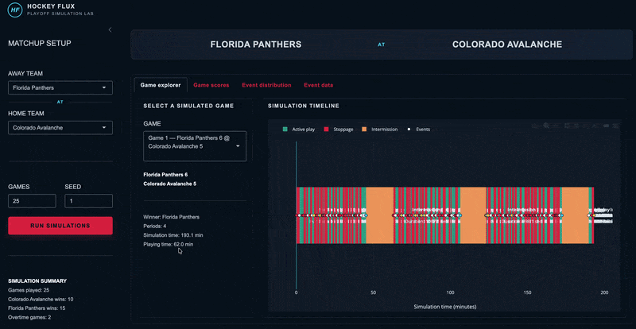

_Have you heard of the [`flux`](https://github.com/jarrod-dalton/flux/tree/main) ecosystem yet? It's a new R framework (Python planned) for developing dynamic, event-driven probabilistic models via simulation. Highly recommend you check it out, starting with the first tutorial [here](https://github.com/jarrod-dalton/flux/blob/main/tutorials/00_start_here.md)._

# Background

When I began learning about [`flux`](https://github.com/jarrod-dalton/flux/tree/main), I started reading the documentation to figure out not only what it _is_ but also how to use it. I spent a lot of time in the [tutorials](https://github.com/jarrod-dalton/flux/blob/main/tutorials/00_start_here.md) trying to understand concepts, how the code maps to those concepts, and submitting nit-picky issues to GitHub to try to make the code and documentation row together more seamlessly. Then I began trying to apply the framework to a project, manually defining schemas and event processes. I definitely made a lot of progress compared to when I started (i.e., when I knew absolutely nothing about it), but something still didn't click--I could only get so far without knowing what to do next. I didn't have any intuition about what the states should be, what processes and events were important, or what outcomes mattered. So trying to _learn_ the [`flux`](https://github.com/jarrod-dalton/flux/tree/main) framework _while_ trying to implement it on a project was rather difficult.

Then it hit me: **_In order to learn it, I need to work on developing a model for a system that I actually understand._** 

I had an epiphany: a **hockey game**.

In that moment not only did I see my path to learning [`flux`](https://github.com/jarrod-dalton/flux/tree/main) become more clear, I already felt like I'd gained intuition about the framework more broadly because I could immediately envision all the components, states, events, and processes that make up a hockey game. The _idea_ of [`flux`](https://github.com/jarrod-dalton/flux/tree/main) became much more valuable.

# Simulating the system

And so I began going to down the road of using [`flux`](https://github.com/jarrod-dalton/flux/tree/main) to _simulate a hockey game_ (the codebase is [here](https://github.com/zajichek/hockey-flux)). I could immediately see some fascinating places you could take this:

* Games themselves are the foundation of the system
* Players could become independent entities in the system that live within the game
* You could even add a Coach entity in order to create policies around the most glaring decision points, like pulling the goalie
* ...and so on

But, we need to start somewhere, so I just started small.

## Making a game

I began thinking about the simplest foundation I could start building for this model. Namely, it was a _game_ (and more specifically, I narrowed it to an NHL playoff game). So what attributes or _states_ does this type of hockey game have? Some of the obvious things come to mind: game clock, scoreboard, whether play is active or it's in between whistles/intermission, whether the game is in overtime, how many players are on the ice for each team, where the puck currently is, etc. So I began manually encoding those things in [`flux`](https://github.com/jarrod-dalton/flux/tree/main) syntax.

Then you start to think about _events_. What sort of things _happen_ during the game? Stuff like: goals are scored, whistles are blown (e.g., icing, penalty, offsides, etc.), the period ends, etc. Similarly, I began encoding these into event-process definitions using quick but reasonable logic. For example, goals are scored through a Poisson process with a default, sensible rate, like this:

```r
goal_event <-
  function(entity) {
    list(
      time_next = entity$last_time + rexp(1, rate = 6 / 3600),
      event_type = sample(
        x = c("goal_home", "goal_away"),
        size = 1,
        prob = c(.52, .48)
      )
    )
  }
```

You then define the stoppage criteria for the simulation: the game ends after the third period if the game is not tied, otherwise you keep the simulation going in 20-minute intervals until a goal is scored. Easy enough. 

And shortly thereafter I had a "working" simulation: I could create a game entity, set some initial states (like who the teams were) and a simulation would run, accumulating goals and whistles until the game ended and we had a winner. Great!

## Adding more detail

Naturally, as I looked at the simulation output, despite it actually producing a "real" shell of a hockey game, there was _so_ much that was _not_ accounted for:

* Intermissions should contribute to simulation time but _not_ game time.
* Puck drops are events. They start the game, each period, and occur after every whistle.
* When penalties occur, the rate of goals should change. Futher, we need to track how long the player(s) are in the penalty box for, and know what the strength is of each team at any given time.
* ...the list goes on

So, I invoked an assistant to start rapidly plucking away at these: [Codex](https://openai.com/codex/) (if you're not familiar, it is an AI coding assistant which comes with your $20/month [ChatGPT](https://chatgpt.com/) subscription, and I could use it straight in [Positron](https://positron.posit.co/)).

It went on for a while. I went back and forth, creating strategies of features I want to add next, asking Codex to build a plan for it, reviewed the plan, had it implement the plan, and then reviewed the implementation so I could follow/understand/validate what is happening as I go (it actually was a pretty good experience overall, feeling like you're in the drivers seat provided you can maintain that understanding of what's happening). 

And after a bunch of iterations I had an even _better_ model of an NHL playoff game. It now accounted for penalities (and the change in goal scoring rates when they happen), appropriately managed the game clock across all periods, stoppages, intermissions, and overtime _separate_ from simulation time, updated the game status as different events occurred, added puck drops after whistles, etc. I even generated a cool [Shiny](https://shiny.posit.co/) app that provides an interface to simulate specific matchups and explore results:



I was amazed how fast I could get to this point, and it all seemed like a reasonable representation of a hockey game.

## The infinite loop

However, my list of every small nuance kept getting bigger. Even though I had the clock structure and a seemingly reasonable hockey game being simulated, it _just wasn't enough_. Different matchups probably need different goal scoring rates, _who_ is on the ice affects what events will occur, where the puck is matters as to whether or not a goal might be scored, and we didn't even consider yet the concept of a goalie being pulled. There was a _long_ way to go.

And then I realized: **_The number of nuances that I would need to implement to be satisfied with the simulation was going to be never-ending._**

I was in an infinite loop of trying to model the system of an NHL playoff game, with no end in sight.

<br>

# Simulating an _answer_ (instead)

After a while of hopelessly going back and forth of what detail I wanted to build out in my next model iteration, I'd reached a point of demotivation where I'd just be doing this endlessly. At that point I didn't even feel like working on it anymore. 

It was in that ponderance where I thought of the most fundamental question I should have asked myself right away: **_What am I actually trying to do with this model?_**

I realized that I was trying to create the perfect model of a _system_ (i.e, a hockey game) without any sort of direction about what I want to do with it. What question did I want to answer? Did I just want to simulate a hockey game for the hell of it? What's the actual point? It was essentially a fool's errand.

## Invoking the "estimand" concept

So I thought, _"How can we start to add some **structure**, not around the system we're modeling, but around the actual purpose of **why** we're building it in the first place?"_. The idea of [estimands](https://en.wikipedia.org/wiki/Estimand) came to mind.

In this paradigm, we specify the specific quantity we want to estimate, and build our analytic workflow around answering that specific question. This includes modeling design, structure, assumptions, etc. And if we want to answer a slightly different question, even if related to the same topic/context, we might need to adjust the entire thing. So I started excitedly asking myself:

* **Can this be applied to Flux models?**

* **What if we started with the question we're trying to answer and then specifically design a simulation model to answer it?**

* **What if it's not a single hockey game simulator to answer every question about hockey, but rather a model designed to answer a specific hockey question?**

These are what led me to see light at the end of the tunnel. Depending on the _specific_ question(s) being asked, we may not need to design the most sophisticated model of the system, but rather a **model only complex enough to provide an answer to the question(s)**.

## Counterfactuals and potential outcomes

In the same light, I saw an additional benefit of doing this in [`flux`](https://github.com/jarrod-dalton/flux/tree/main). The entire premise of the [potential outcomes](https://en.wikipedia.org/wiki/Rubin_causal_model) framework is that we can only observe, for example, a single patient undergo a single treatment path. That's the world we live in. There's an alternate world that exists where the patient didn't take that treatment at that time (or took another one). But we didn't observe that one. If we _could_ observe both, then in order estimate the causal effect of the treatment, we'd literally just look at the difference between the two worlds. Since we can't observe both, we need all of the fancy methods that make up [causal inference](https://en.wikipedia.org/wiki/Causal_inference) to try to deduce what this difference would be _had_ we observed both worlds.

But in [`flux`](https://github.com/jarrod-dalton/flux/tree/main), we _can_ look at both worlds!

The concepts of [decisions, policies, and actions](https://github.com/jarrod-dalton/flux/blob/main/tutorials/03_decisions_policy.md) are native to the [`flux`](https://github.com/jarrod-dalton/flux/tree/main) framework. A main feature of it is that you are able to evaluate different decision policies at particular points in time and view the downstream differences in outcomes. From the [tutorial](https://github.com/jarrod-dalton/flux/blob/main/tutorials/00_start_here.md#4-policy-evaluation-and-counterfactual-analysis):

> "Run the same cohort of entities through alternative policies with matched seeds. The only difference between runs is the policy — stochastic paths are identical. Compare trajectory records to quantify the effect of policy changes."

This is pretty much exactly the idea of [potential outcomes](https://en.wikipedia.org/wiki/Rubin_causal_model). 

So with the ideas of estimands + counterfactuals in mind, it seemed that integrating these concepts into [`flux`](https://github.com/jarrod-dalton/flux/tree/main) model development could be very useful. For my brain at least.

## Applying this to a hockey game

* Specific question: goalie pull
* Realizing through this structured thinking that goalie's are really only pulled in the last 10 minutes (though they could be earlier)
* Defining the denominator, means my simulation only needs to start in the last 10 minutes of a game to get _an_ answer to my question
* Not to say you _couldn't_ do something more complex. But this gets at the idea of model sufficiency.

# Formalizing the Flux Estimand

I started going down the rabbit hole of formalizing these ideas into a more concrete framework.


