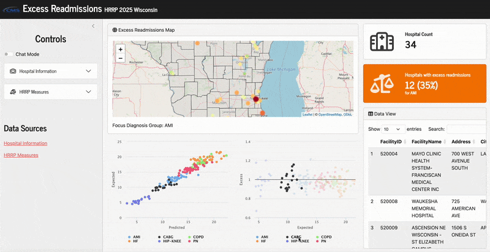
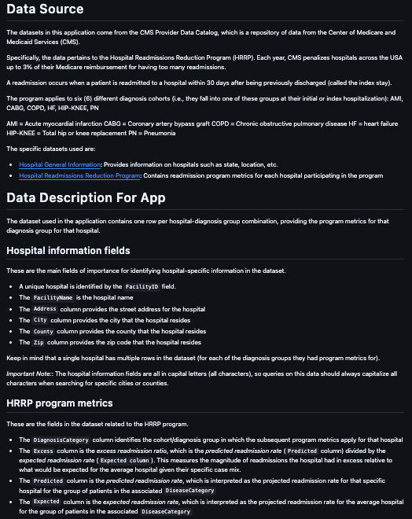

 
# Case study

- **Context**: We want to build a Shiny application to explore results from the [Hospital Readmissions Reduction Program (HRRP)](https://www.cms.gov/medicare/payment/prospective-payment-systems/acute-inpatient-pps/hospital-readmissions-reduction-program-hrrp) across the state of Wisconsin.

<br>

- **Key functionality**: Enable the user to toggle between traditional data filters and a natural language chat interface to update reactive output

# First, the app



Live app is hosted on Posit Connect Cloud [here](https://0196f590-15b7-8b36-3010-eb5a0d8a6d94.share.connect.posit.cloud/). 

::: {.notes}
Query: "Show me the top 10 hospitals with most excess readmissions for heart failure"
:::

# SQL queries?

Why did it write this?

```
SELECT * FROM master_dat WHERE DiagnosisCategory = 'HF' ORDER BY Excess DESC LIMIT 10
```

- Comes from the [`querychat`](https://posit-dev.github.io/querychat/) R package

- Conceptual flow:
  1. User asks a question
  2. LLM generates a SQL query based on _metadata_
  3. Query is executed on your dataset _locally_
  4. Filtered data can be consumed by downstream reactives as normal

- Provides a _clever_ way to manipulate your app content through natural language while maintaining data security

# How the code looks

:::: {.columns}

::: {.column width="50%"}

**1. Initialize chat object**

```r
library(querychat)

# In global.R
querychat_config <-
  querychat_init(
    data_source = querychat_data_source(master_dat, tbl_name = "HospitalHRRP"),
    client = ellmer::chat_google_gemini,
    greeting = "Ask me a question about the HRRP in Wisconsin",
    data_description = readLines("data_description.md")
  )
```

**2. Create chat UI**

```r
# In ui.R
querychat_ui(id = "chat")
```

:::

::: {.column width="50%"}

**3. Access filtered data**

```r
# In server.R
querychat <- querychat_server("chat", querychat_config)
current_hospitals <- reactive({querychat$df()})
```

**4. Use in app content**

```r
# In server.R (display hospital count)
output$hospital_count <-
  renderText({
    n_distinct(current_hospitals()$FacilityID)
  })
```

:::

::::

# The key to success

:::: {.columns}

::: {.column width="60%"}

_Supply thorough context about your data_

<br>
<br>

```{.r code-line-numbers="5"}
querychat_init(
  data_source = querychat_data_source(master_dat, tbl_name = "HospitalHRRP"),
  client = ellmer::chat_google_gemini,
  greeting = "Ask me a question about the HRRP in Wisconsin",
  data_description = readLines("data_description.md")
)
```

View source document [here](https://github.com/centralstatz/hospital_readmissions_explorer/blob/main/data_description.md).

:::

::: {.column width="40%"}

`data_description.md`



:::

::::

# Back to the toggle...

How do we make this work?

# Using conditional panels!

:::: {.columns}

::: {.column width="45%"}

In `ui.R`

```r
# Make a toggle
bslib::input_switch(
  id = "chat_mode",
  label = "Chat Mode"
),
        
# Show manual filters
conditionalPanel(
  condition = "!input.chat_mode",
  datamods::select_group_ui(id = "hospitals", params = ...)
),

# Show chat interface
conditionalPanel(
  condition = "input.chat_mode",
  querychat_ui(id = "chat") 
),
```

Click to see the full [`ui.R`](https://github.com/centralstatz/hospital_readmissions_explorer/blob/main/ui.R) and [`server.R`](https://github.com/centralstatz/hospital_readmissions_explorer/blob/main/server.R) files.

:::

::: {.column width="55%"}

In `server.R`

```r
# Traditional (simultaneous) filter
current_hospitals_temp <-
  datamods::select_group_server(
    id = "hospitals",
    data = reactive(master_dat),
    vars = reactive(c("FacilityName", "City", "County", "Zip"))
  )

# Make the chat server
querychat <- querychat_server("chat", querychat_config)

# Select data based on toggle state
current_hospitals <- reactive({
    if (input$chat_mode) {
      temp_hospitals <- querychat$df()
    } else {
      temp_hospitals <- current_hospitals_temp()
      # APPLY MANUAL FILTER LOGIC
    }
    temp_hospitals
  })
```

:::

::::

# Summary

- Use the [`querychat`](https://posit-dev.github.io/querychat/) package to build the chat interface and server connection
  + It's _key_ to specify the `data_description` argument thoroughly for better chat experience

- The `bslib::input_switch()` function creates the toggle, and `conditionalPanel()` renders the set of filters displayed to the user, depending on what is selected

- `reactive()` objects on the server side help pick the right dataset depending on the state of the toggle
  + _Keep things upstream_: Recommend designing/pre-processing your data in a sensisble way to allow congruency among filtered data output regardless of method (so downstream content doesn't care about source)

# Thank you!

**Links**:

- Live app: [https://0196f590-15b7-8b36-3010-eb5a0d8a6d94.share.connect.posit.cloud/](https://0196f590-15b7-8b36-3010-eb5a0d8a6d94.share.connect.posit.cloud/)
- App source code: [https://github.com/centralstatz/hospital_readmissions_explorer](https://github.com/centralstatz/hospital_readmissions_explorer)
- Slides: [https://www.zajichekstats.com/presentations/toggling-between-traditional-and-chat-based-data-filters/](https://www.zajichekstats.com/presentations/toggling-between-traditional-and-chat-based-data-filters/)